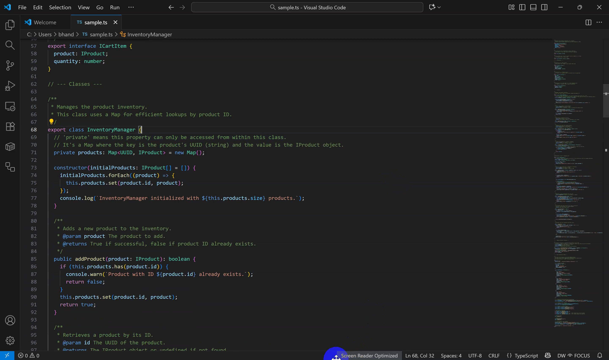
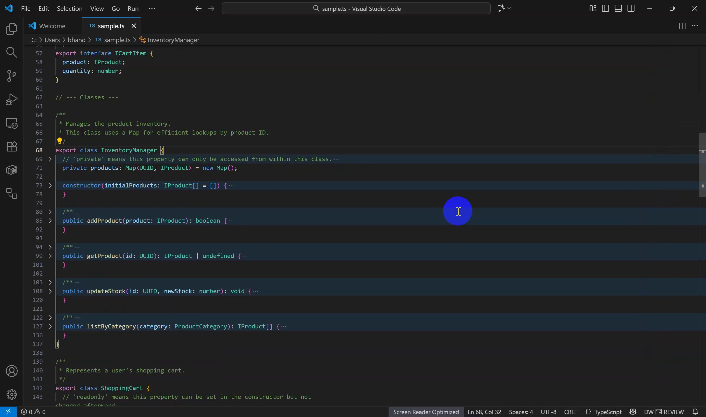

# Dynamic Workspace — VS Code Extension

Adapts your editor to **FOCUS** (unfold, minimap on, wrap off) vs **REVIEW** (fold to depth, minimap off, bounded wrap), driven by a **local posture sensor**. The extension can now **auto-download & auto-start** the sensor.

## Features

- Policy-driven **mode switching** with confidence & health gating.
- **Status bar** control (pause/snooze/force, health hints).
- One-click **Calibration** (2 steps).
- **Camera selector** (Quick Pick → switches active camera).
- Optional **Auto-download + Auto-start** the sensor binary on activation.

## Install

### Marketplace (recommended)
Search for **“Dynamic Workspace (Posture-aware)”** in the Extensions view.

### From a VSIX
Download from the project’s Releases → Extensions “⋯” menu → *Install from VSIX…*

## First-time setup

### Easiest (recommended)
1. Open **Settings → Dynamic Workspace**.
2. Enable **`Auto-Start Sensor`**.
3. Keep **`Sensor Path`** empty. When prompted, click **Install** — the extension will download the correct sensor for your platform into your user storage and start it automatically.

### Advanced
- Set **`Sensor Path`** to an existing binary and leave **`Auto-Start Sensor`** enabled, **or**
- Run the sensor yourself and ensure **`Sensor Url`** matches (default `ws://localhost:8765`).

Then:

- **Calibrate**: Command Palette → *Dynamic Workspace: Calibrate…* (sit back, then lean in).
- **Select Camera**: Command Palette → *Dynamic Workspace: Select Camera…*.

The status bar shows `DW <icon> <mode> ·<health>`; click it to pause/resume quickly.

## Commands

- **Dynamic Workspace: Pause/Resume**
- **Dynamic Workspace: Snooze…**
- **Dynamic Workspace: Force Focus / Force Review / Clear Override**
- **Dynamic Workspace: Reconnect Sensor**
- **Dynamic Workspace: Calibrate…**
- **Dynamic Workspace: Select Camera…**
- **Dynamic Workspace: Start Sensor / Stop Sensor**
- **Dynamic Workspace: Install Sensor** (manual trigger for the downloader)

## Settings

> `File → Preferences → Settings → Extensions → Dynamic Workspace`

- **Auto-Start Sensor** (`dynamicWorkspace.autoStartSensor`)
- **Auto-Download Sensor** (`dynamicWorkspace.autoDownloadSensor`)
- **Sensor Path** (`dynamicWorkspace.sensorPath`)
- **Sensor Url** (`dynamicWorkspace.sensorUrl`, default `ws://localhost:8765`)
- **UI Confidence Min** (`dynamicWorkspace.uiConfMin`, default `0.5`)
- **Heartbeat Ms** (`dynamicWorkspace.heartbeatMs`, default `4000`)
- **Fold Level On Review** (`dynamicWorkspace.foldLevelOnReview`, default `2`)
- **Zen Mode On Review** (`dynamicWorkspace.zenModeOnReview`, default `false`)
- **Affect Markdown** (`dynamicWorkspace.affectMarkdown`, default `false`)
- **Debounce Ms** (`dynamicWorkspace.debounceMs`, default `250`)
- **Language Allowlist** (`dynamicWorkspace.languageAllowlist`)
- **Scroll Pause Ms** (`dynamicWorkspace.scrollPauseMs`, default `1200`)
- **Min Lines To Fold** (`dynamicWorkspace.minLinesToFold`, default `150`)
- **Camera Index** (`dynamicWorkspace.cameraIndex`)

## Behavior details

- **Viewport stability**: Anchor/restore around folds; pause briefly after user scroll to avoid flicker.
- **Health gating**: If the sensor reports `PAUSED` (e.g., no camera), adaptation is disabled; `DEGRADED` only shows a warning.
- **Lifecycle**: The extension sends a WebSocket **`shutdown`** on stop/exit, and the sensor watches the extension host PID, so it **doesn’t stay running** after VS Code closes.

## Troubleshooting

- **Disconnected** — start the sensor or fix **`Sensor Url`**.
- **Port already in use** — stop any previous sensor instance (use *Stop Sensor*).
- **macOS first run** — you may need to approve camera access; if you manually downloaded the binary, remove quarantine attributes.

## Privacy

All processing is local. No frames or telemetry leave your machine.
