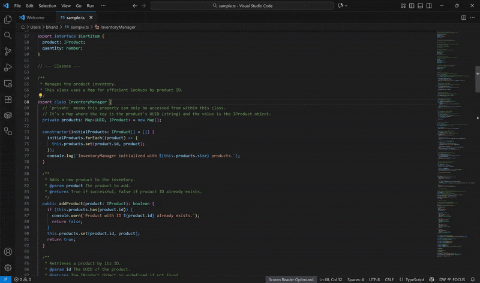

# Dynamic Workspace — VS Code Extension

Adapts your editor to **FOCUS** (unfold, minimap on, wrap off) vs **REVIEW** (fold to depth, minimap off, bounded wrap), driven by a local posture sensor.

> **Overview**
>
> 

## Features

- Policy-driven **mode switching** with confidence & health gating.
- **Status bar** control (pause/snooze/force, health hints).
- One-click **Calibration** (2 steps).
- **Camera selector** (Quick Pick → switches active camera).
- Optional **Auto-start sensor** on activation (configurable path).

## Install

### Marketplace (recommended)
Search for **“Dynamic Workspace (Posture-aware)”** in the Extensions view.

### From a VSIX
Download from the project’s GitHub Releases → Extensions “⋯” menu → *Install from VSIX…*

## First-time setup

Pick **one** of the following to provide the sensor:

1. **Auto-start the sensor**
   - Settings → **Dynamic Workspace**
   - ✅ `Auto-Start Sensor: Enabled`
   - Set `Auto-Start Sensor: Path` to your `dw-sensor` binary (`.exe` on Windows).

2. **Run the sensor yourself**
   - Start it from the `sensor/` folder:
     ```bash
     python main_sensor.py --port 8765 --camera 0
     ```
   - Ensure `Dynamic Workspace › Sensor Url` matches your port.

Then:

- **Calibrate**: Command Palette → *Dynamic Workspace: Calibrate…* (sit back, then lean in).
- **Select Camera**: Command Palette → *Dynamic Workspace: Select Camera…*.

The status bar shows `DW <icon> <mode> ·<health>`; click it to pause/resume quickly.

## Commands

- **Dynamic Workspace: Pause/Resume** — toggles adaptation (freezes at last stable mode).
- **Dynamic Workspace: Snooze…** — temporarily pause for 5/15/30/60 minutes.
- **Dynamic Workspace: Force Focus** — lock to FOCUS; **Force Review** — lock to REVIEW.
- **Dynamic Workspace: Clear Override** — return to sensor-driven behavior.
- **Dynamic Workspace: Reconnect Sensor** — restart the socket client.
- **Dynamic Workspace: Open Settings** — jump to extension settings.
- **Dynamic Workspace: Calibrate…** — run 2-step calibration.
- **Dynamic Workspace: Select Camera…** — list/switch available cameras.

## Settings

> `File → Preferences → Settings → Extensions → Dynamic Workspace`

- **Auto-Start Sensor: Enabled** (`dynamicWorkspace.autoStartSensorEnabled`)  
  If true, the extension spawns the sensor binary on activation and kills it on deactivation.
- **Auto-Start Sensor: Path** (`dynamicWorkspace.autoStartSensorPath`)  
  Filesystem path to `dw-sensor` (`.exe` on Windows).
- **Sensor Url** (`dynamicWorkspace.sensorUrl`)  
  Defaults to `ws://localhost:8765`.
- **UI Confidence Min** (`dynamicWorkspace.uiConfMin`)  
  Minimum confidence to preview transitions (default `0.5`).
- **Heartbeat Ms** (`dynamicWorkspace.heartbeatMs`)  
  Staleness threshold before connection is marked stale (default `4000` ms).
- **Fold Level On Review** (`dynamicWorkspace.foldLevelOnReview`)  
  Depth for `editor.foldLevelN` (default `2`).
- **Zen Mode On Review** (`dynamicWorkspace.zenModeOnReview`)  
  Enter Zen in REVIEW; exit in FOCUS (default `false`).
- **Affect Markdown** (`dynamicWorkspace.affectMarkdown`)  
  Apply transforms to Markdown (default `false`).
- **Debounce Ms** (`dynamicWorkspace.debounceMs`)  
  Debounce for applying mode changes (default `250` ms).
- **Language Allowlist** (`dynamicWorkspace.languageAllowlist`)  
  Only affect these language IDs (empty = all).
- **Scroll Pause Ms** (`dynamicWorkspace.scrollPauseMs`)  
  After you scroll, pause adaptations for this many ms so we don’t fight your gesture (default `1200` ms).
- **Min Lines To Fold** (`dynamicWorkspace.minLinesToFold`)  
  Skip folding on very small files (default `150` lines).

## Behavior details

- **Viewport stability**: Folding/unfolding can shift the viewport; the extension captures an anchor line and restores if the jump is large. It also pauses briefly after user scroll to avoid flicker.
- **Health gating**: If the sensor reports `PAUSED` (e.g., no camera), adaptation is disabled; `DEGRADED` only shows a warning.
- **Force/Overrides**: Force Focus/Review overrides the sensor until cleared.

## Troubleshooting

- **Status: Disconnected**  
  Start the sensor or set `Sensor Url` correctly. If using auto-start, verify the binary path.
- **Status: PAUSED (camera_error)**  
  Ensure camera permission and no other app is locking the camera.
- **Camera not listed**  
  Use “Select Camera…”; on Linux, the USB camera may be index `1` or `2`.
- **macOS first run**  
  You may need to remove quarantine attributes and approve camera access.

## Development

```bash
# compile
npm ci
npm run compile

# debug
# From VS Code, press F5 (Extension Development Host).
# Use the “Dynamic Workspace” Output channel for logs.
```

## Privacy

The extension only talks to your local sensor URL and stores settings locally. No frames or telemetry leave your machine.

## License

MIT. See root `LICENSE`.
